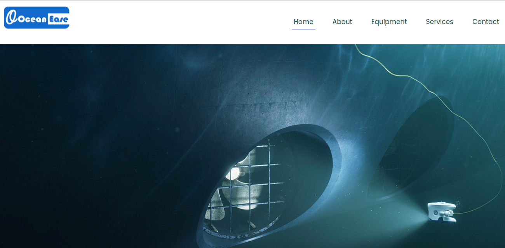

<br />
<p align="center">
  <h1 align="center"> OceanEase App</h1>
 
  <p align="center">
    A React application
    <br />
    <br />
    <a href="https://oceanease.com.ng/">View Demo</a>
    ·
    <a href="https://github.com/kobiyoyo/oceaneaseapp/issues">Report Bug</a>
    ·
    <a href="https://github.com/kobiyoyo/oceaneaseapp/issues">Request Feature</a>
  </p>
  
</p>


## Description
This app aims to showcase, Ocean-ease Ltd a full-service, Underwater ROV Inspection Company, providing innovative and proven technical services to the offshore oil & gas and Maritime Industries. Ocean-ease Ltd is a company founded by ROV and offshore professionals from a need to provide safe and cost-effective underwater inspection solutions to the offshore oil & gas / marine customers and clients. Our services use the latest innovative Mini ROV technologies as we are innovators in the use of Mini ROVs.

## Built With
- Javascript
- React
- Bootstrap 4
- Sass

## Getting started
> To get started with the app, clone the repo and then install the needed dependencies:

```
$ npm install
```


> Run the app in a local server:

```
$ yarn dev-server
```

## Live version

[Live](https://oceanease.com.ng/)

## Authors

👤 **Adama Chubiyojo Desmond**

-  [Github](https://github.com/kobiyoyo)
-  [Twitter](https://twitter.com/_kobiyoyo)
-  [Linkedin](https://www.linkedin.com/in/chubiyojo-adama/)
-  [Email](mailto:adamachubi@gmail.com)


## 🤝 Contributing

Contributions, issues and feature requests are welcome!<br />Feel free to check [issues page](https://github.com/kobiyoyo/oceanease/issues).

1. Fork it (https://github.com/kobiyoyo/oceanease/fork)
2. Create your working branch (git checkout -b [choose-a-name])
3. Commit your changes (git commit -am 'what this commit will fix/add')
4. Push to the branch (git push origin feature/[feature-name])
5. Create a new Pull Request

## Show your support

Give a ⭐️ if you like this project!


## 📝 License

This project is [MIT](./LICENSE) licensed.
